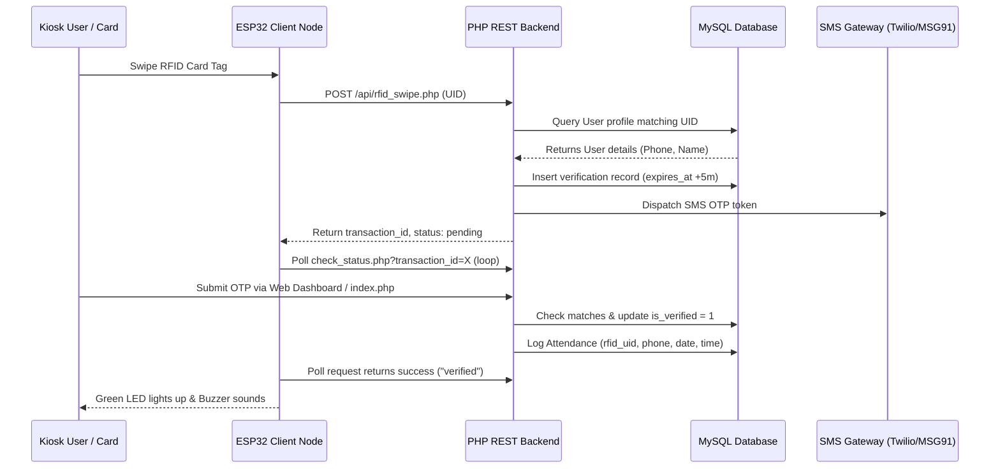

# ESP32 RFID Attendance System with SMS OTP Authentication

A secure, multi-factor attendance logging system integrating physical RFID tags with SMS One-Time Passwords (OTP). Attendance logs are registered to a MySQL database via a modular PHP REST API.

---

## System Architecture Workflow


---

## 1. Hardware Pin Configurations (ESP32)

| ESP32 Pin | Component | RC522 Pin | Description |
| :--- | :--- | :--- | :--- |
| **GPIO 5** | MFRC522 | SDA (SS) | SPI Slave Select |
| **GPIO 18**| MFRC522 | SCK | SPI Clock |
| **GPIO 23**| MFRC522 | MOSI | SPI Master Out Slave In |
| **GPIO 19**| MFRC522 | MISO | SPI Master In Slave Out |
| **GPIO 22**| MFRC522 | RST | Reset Line |
| **GND** | MFRC522 | GND | Ground Reference |
| **3.3V** | MFRC522 | 3.3V | Power Supply (Ensure stable 3.3V) |
| **GPIO 12**| Green LED | Positive Term | Lights up on Verification Success |
| **GPIO 14**| Red LED | Positive Term | Lights up on network loss/rejected tag |
| **GPIO 13**| Piezo Buzzer | Positive Term | Beeps for feedback alerts |

*Note: Add a 220Ω resistor in series with the LEDs to limit current.*

---

## 2. API Endpoint Documentation

All requests return JSON data with appropriate HTTP response codes.

### I. Register card swipe
* **Endpoint:** `POST /api/rfid_swipe.php`
* **Headers:** `X-API-Key: ESP32_SECURE_RFID_ATTENDANCE_API_KEY_2026`
* **Request Body (JSON):**
  ```json
  {
    "uid": "DE-AD-BE-EF"
  }
  ```
* **Responses:**
  - `200 OK` (Pending verification):
    ```json
    {
      "status": "pending",
      "message": "OTP generated and sent to phone.",
      "transaction_id": 45,
      "phone": "+91******9999",
      "name": "Rajesh Kumar"
    }
    ```
  - `200 OK` (Already registered today):
    ```json
    {
      "status": "already_marked",
      "message": "Attendance already marked for today.",
      "user": "Rajesh Kumar"
    }
    ```

### II. Check Authentication Status
* **Endpoint:** `GET /api/check_status.php?transaction_id=45`
* **Response (Pending):**
  ```json
  {
    "status": "pending",
    "message": "Awaiting OTP code verification."
  }
  ```
* **Response (Verified Success):**
  ```json
  {
    "status": "verified",
    "message": "Verification successful. Attendance recorded.",
    "user": "Rajesh Kumar",
    "rfid_uid": "DE-AD-BE-EF"
  }
  ```

---

## 3. Deployment Instructions

### A. Server Setup (XAMPP / local environment)
1. Copy the `esp32-rfid-attendance` folder into your server directory (e.g., `C:\xampp\htdocs\esp32-rfid-attendance`).
2. Start **Apache** and **MySQL** modules inside the XAMPP Control Panel.
3. Open **phpMyAdmin** (`http://localhost/phpmyadmin`) in your web browser.
4. Click **New**, name the database `rfid_attendance`, and click **Create**.
5. Select the database, click the **Import** tab, upload `database.sql`, and click **Go**.
6. Open `config.php` to customize settings:
   - Select SMS Gateway (default is `'simulated'` which displays codes inside the browser console logs for instant sandbox testing).
   - Change `SMS_GATEWAY` to `'twilio'` or `'msg91'` and add your keys/tokens to trigger real mobile SMS delivery.

### B. Hardware Setup (ESP32 via Arduino IDE)
1. Install the Arduino IDE on your computer.
2. Go to **File > Preferences > Additional Boards Manager URLs** and enter:
   `https://dl.espressif.com/dl/package_esp32_index.json`
3. Go to **Tools > Board > Boards Manager**, search for `esp32`, and install the library.
4. Go to **Sketch > Include Library > Manage Libraries**, search and install:
   - **MFRC522** (by GithubCommunity)
   - **ArduinoJson** (by Benoit Blanchon)
5. Open `esp32/esp32_rfid.ino` in Arduino IDE.
6. Configure configurations in the code:
   - `ssid`: Your local Wi-Fi SSID network name.
   - `password`: Your network passcode.
   - `serverIp`: The local IPv4 address of your XAMPP host server (e.g., `192.168.1.100` - do NOT use `localhost` since the ESP32 must make network requests to the computer).
7. Select the correct board type (e.g., **ESP32 Dev Module**), choose the COM port, and click **Upload**.

---

## 4. Testing & Verification

1. Swipe your registered RFID tag card (Default testing UID is `DE-AD-BE-EF`).
2. The ESP32 RED LED will go off, the Green LED will blink slowly, and the Serial Monitor will output `Awaiting SMS OTP verification...`.
3. Open the web panel: `http://localhost/esp32-rfid-attendance/` in your browser.
4. Enter the user's phone number: `9999999999` (if using the seeded Rajesh profile).
5. If using `simulated` mode, look at the **Simulated SMS Network Logs** at the bottom of the page to find the generated 6-digit OTP code.
6. Enter the 6 digits in the inputs and click **Verify & Mark Attendance**.
7. The web interface will show a success checkmark, the ESP32 Green LED will stay on, the buzzer will make a pleasant long beep, and Serial Monitor will verify `Attendance confirmed!`.
